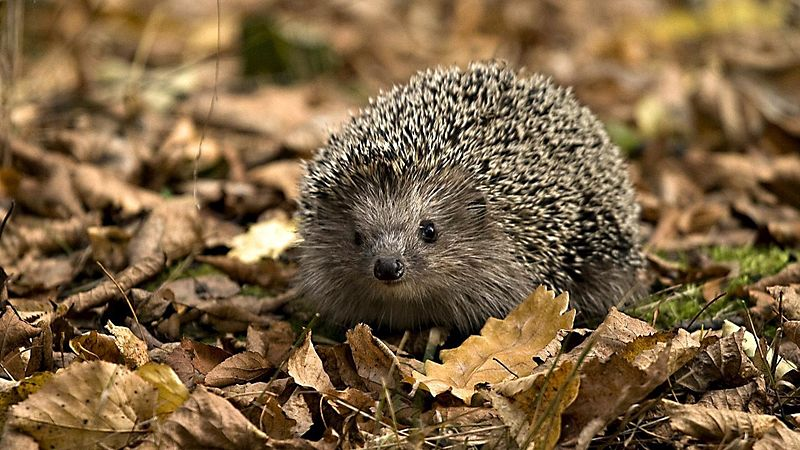

# Добро пожаловать!
## Я ежик Петр

## Зачем мне домашняя страница?
Я хочу, чтоб люди лучше узнали нас, жителей _**леса**_. Чтоб поняли, каково это, когда ты живешь среди _листьев_ мокрой осенью. 

## Как попасть ко мне в гости
- Зайти в мой лес
- Пойти по дорожке **вперед**
- Возле пня повернуть **направо**
- Дойти до **муравейника**. Слева от него полянка. Там я и живу. 

## Где посмотреть фотографии моих родственников
1. [Тут](https://www.google.lv/search?hl=en&tbm=isch&q=hedgehog&oq=hedgehog)
2. [Или тут](https://duckduckgo.com/?t=lm&q=hedgehog&iax=images&ia=images)
